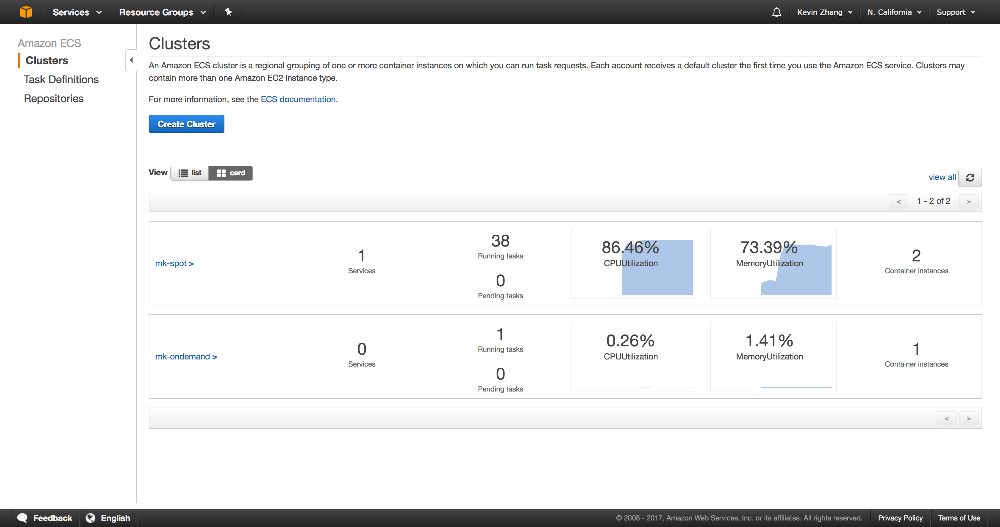

# mk-battlecode



## mk-cluster
This component can run on a `t2.nano` instance as it requires very little computational power. It is
the central component which handles maintaining an-up-to date ranking of the players, recording the 
results for various matches, and storing/sending the players themselves.

> docker run -p 3000:3000 mk-cluster --port 3000

To manually upload bots to the cluster, you can use the below command. Make sure to replace

```
export EC2_INSTANCE=http://ec2-54-215-251-137.us-west-1.compute.amazonaws.com
curl -F "player=@playerB.zip" $EC2_INSTANCE/player/playerB
curl -F "player=@funetqjt.zip" $EC2_INSTANCE/player/funetqjt
curl -F "player=@ghrxmztc.zip" $EC2_INSTANCE/player/ghrxmztc
curl -F "player=@kfvwiwsm.zip" $EC2_INSTANCE/player/kfvwiwsm
curl -F "player=@simqfusk.zip" $EC2_INSTANCE/player/simqfusk
curl -F "player=@sscdekul.zip" $EC2_INSTANCE/player/sscdekul
curl -F "player=@gwhwpljr.zip" $EC2_INSTANCE/player/gwhwpljr
curl -F "player=@hhxktbzq.zip" $EC2_INSTANCE/player/hhxktbzq
curl -F "player=@mioyqiir.zip" $EC2_INSTANCE/player/mioyqiir
curl -F "player=@opqifjtj.zip" $EC2_INSTANCE/player/opqifjtj
curl -F "player=@ydkoevdq.zip" $EC2_INSTANCE/player/ydkoevdq
```

## mk-worker
It is recommended this to run this on a ECS cluster using spot instances at whatever price point 
you find reasonable. Each worker typically uses 0.5 GB of RAM but has been observed to go up to 
1 GB; in addition, the workers are interruptable, making them perfect for spot instances which 
can be significantly cheaper.

> docker run mk-worker http://192.168.1.4:3000

## mk-client
> python mk-client.py init http://ec2-54-219-138-181.us-west-1.compute.amazonaws.com
> python mk-client.py status http://ec2-54-219-138-181.us-west-1.compute.amazonaws.com
> python mk-client.py learn http://ec2-54-219-138-181.us-west-1.compute.amazonaws.com
